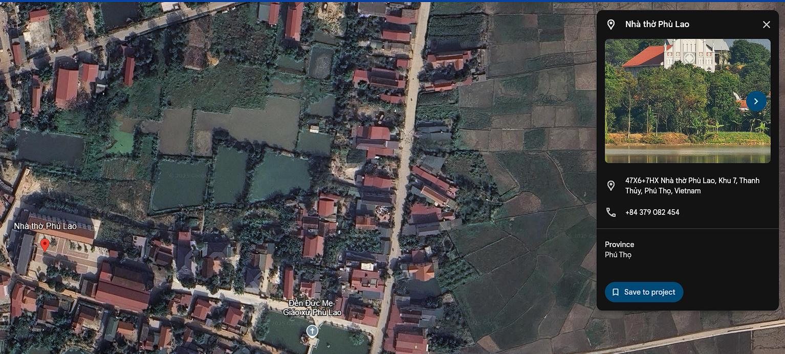
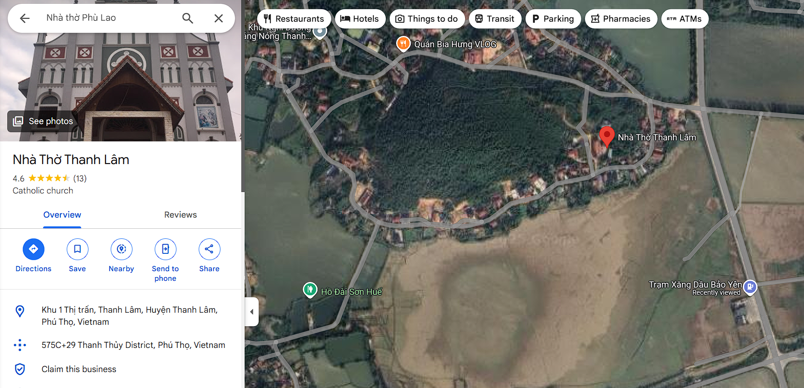

# By The Banana Tree\OSINT

**Flag:** `grey{N21-153_E105-274_nhathothanhlam}`

## Challenge Description

"I saw a church in the distance while travelling. Can you tell me where it is?"

**Requirements:**
- Find the latitude and longitude coordinates where the photo was taken (rounded to 3 decimal places)
- Identify the name of the church in the distance (lowercase, no spaces/punctuation/diacritics)
- Flag format example: `grey{N48-853_E2-349_notredamecathedralofparis}`

## Challenge Image Analysis

*The original challenge image showing a rural road with a church visible in the distance*

Looking at the provided image, several key observations emerged:
- **Geographic indicators**: Tropical/subtropical environment with lush vegetation
- **Road infrastructure**: Rural road with basic infrastructure
- **Key clue**: Road milestone sign visible at the bottom showing "QL32" and "DT317"

The road signs provided crucial geographic information:

**Research findings:**
- **QL**: Quốc Lộ (National Highway) - Vietnam's national road system
- **DT**: Đường Tỉnh (Provincial Road) - Vietnam's provincial road system

**Conclusion**: The location is confirmed to be in **Vietnam**.

Since DT (provincial roads) are more specific than QL (national highways), I focused on mapping DT317:

1. Used Google Earth to trace DT317
2. Applied religious places filter to identify churches along the route
3. Searched for church structures matching the image

After systematic searching along DT317, I discovered:

**First candidate**: Nhà Thờ Phú Lao
- Structure appeared to match the church in the distance
- Location seemed consistent with the road network

*Nhà Thờ Phú Lao - initial identification*

**Critical realization**: The challenge asks for the location where the **photo was taken**, not the church's location.

I spent considerable time trying to match the exact angle and perspective from the original photo using Google Maps satellite view, but couldn't find the precise viewpoint.

Since ground-level Street View wasn't available in the rural area, I searched for alternative viewpoints:

**Discovery**: Found a 360-degree aerial photograph near the suspected location.

Upon closer examination of the aerial 360° view:
- The church visible was **different** from Nhà Thờ Phú Lao
- The actual church in the challenge image was **Nhà Thờ Thanh Lâm**

*Nhà Thờ Thanh Lâm - correct identification*

With the correct church identified, finding the photo location became manageable:

**Key landmark**: Road intersection visible in both the challenge image and satellite view
**Method**: Cross-referenced the intersection with the church's position and angle

**Final coordinates**: `21.153487637898248, 105.27430107502215`
**Church name**: Nhà Thờ Thanh Lâm

### Step 10: Flag Construction

Following the specified format:
- Latitude: N21.153 (rounded to 3 decimal places)
- Longitude: E105.274 (rounded to 3 decimal places)  
- Church name: "nhathothanhlam" (lowercase, no spaces/diacritics)

**Flag**: `grey{N21-153_E105-274_nhathothanhlam}`
